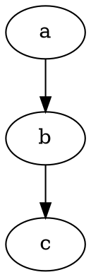

## examples of Graphviz code block

### basic usage


### specify layout engine
```{.graphviz layout=neato}
digraph {
  a -> b;
  b -> c;
}
```

### error in code
```graphviz
digraph {
  a -- b;
  b -- c;
}
```
